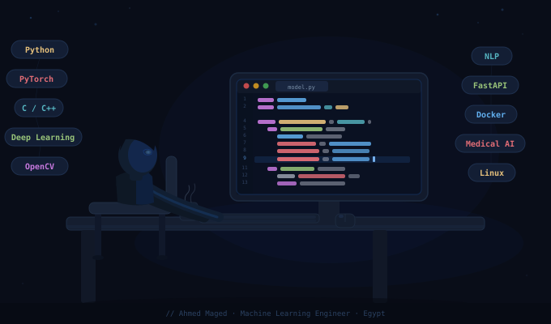

<div align="center">



---

# Ahmed Maged


<br/>

💡 **Building AI systems &nbsp;•&nbsp; Solving problems &nbsp;•&nbsp; Shipping real projects**

<br/>

<a href="mailto:ahmedmaged2004zsc@gmail.com">
  
</a>
&nbsp;
<a href="https://www.linkedin.com/in/ahmed-maged-swe/">
  
</a>
&nbsp;
<a href="https://github.com/Ahmd00z">
  
</a>

</div>

---

## 🎯 About Me

```python
class AhmedMaged:
    def __init__(self):
        self.role      = "Machine Learning Engineer"
        self.location  = "Egypt 🇪🇬"
        self.languages = ["Python", "C", "C++", "Java"]
        self.interests = ["Deep Learning", "Computer Vision", "Medical AI", "NLP"]
        self.focus     = "ChestX-MTL — Multi-Task Learning for Chest X-Ray Analysis"

    def say_hi(self):
        return "Building AI that saves lives, one model at a time! 🚀"
```

- 🔬 Passionate about building efficient, AI-driven solutions to real-world problems
- 🧠 Skilled in ML pipelines, deep learning models, embedded systems & deployment
- 🏆 Competitive Programmer with strong problem-solving instincts
- 🫁 Currently working on **ChestX-MTL** — multi-task segmentation & classification

---

## 🛠️ Tech Stack

### 💻 Languages


### 🤖 Machine Learning & AI


### 📊 Data Science


### 🌐 Web & Deployment


### 🛠️ Tools & Platforms


### 🔧 Embedded Systems


---

## 📫 Connect With Me

<div align="center">

| Platform | Link |
|----------|------|
| 📧 Email | [ahmedmaged2004zsc@gmail.com](mailto:ahmedmaged2004zsc@gmail.com) |
| 💼 LinkedIn | [linkedin.com/in/ahmed-maged-swe](https://www.linkedin.com/in/ahmed-maged-swe/) |
| 🐙 GitHub | [github.com/Ahmd00z](https://github.com/Ahmd00z) |

</div>

---

<div align="center">

💡 *"The best way to predict the future is to build it."*


</div>
